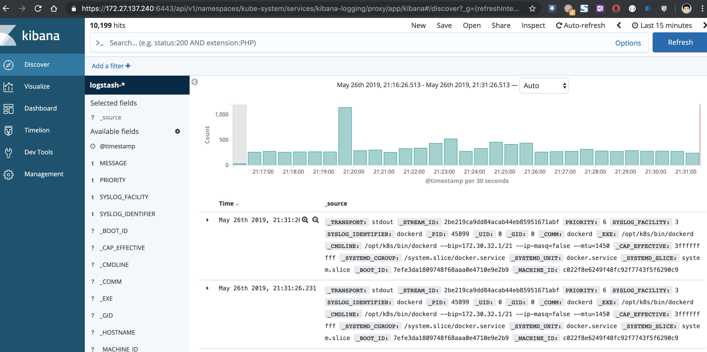

tags: addons, EFK, fluentd, elasticsearch, kibana

# 09-5.部署 EFK 插件

<!-- TOC -->

- [09-5.部署 EFK 插件](#09-5部署-efk-插件)
    - [修改配置文件](#修改配置文件)
    - [执行定义文件](#执行定义文件)
    - [检查执行结果](#检查执行结果)
    - [访问 kibana](#访问-kibana)

<!-- /TOC -->

注意：
1. 如果没有特殊指明，本文档的所有操作**均在 k8s-dev-master01-54 节点上执行**。
2. kuberntes 自带插件的 manifests yaml 文件使用 gcr.io 的 docker registry，国内被墙，需要**手动替换**为其它 registry 地址；
3. 可以从微软中国提供的 [gcr.io 免费代理](http://mirror.azure.cn/help/gcr-proxy-cache.html)下载被墙的镜像；

## 修改配置文件

将下载的 kubernetes-server-linux-amd64.tar.gz 解压后，再解压其中的 kubernetes-src.tar.gz 文件。

``` bash
cd /opt/k8s/work/kubernetes/
tar -xzvf kubernetes-src.tar.gz
```

EFK 目录是 `kubernetes/cluster/addons/fluentd-elasticsearch`。

``` bash
$ cd /opt/k8s/work/kubernetes/cluster/addons/fluentd-elasticsearch
$ cp fluentd-es-ds.yaml  fluentd-es-ds.yaml.orig
$ diff fluentd-es-ds.yaml.orig fluentd-es-ds.yaml
105c105
<           path: /var/lib/docker/containers
---
>           path: /data/k8s/docker/data/containers/
```

## 执行定义文件(替换es镜像  gcr.azk8s.cn/fluentd-elasticsearch/elasticsearch:v6.6.1)

``` bash
$ pwd
/opt/k8s/work/kubernetes/cluster/addons/fluentd-elasticsearch
$ ls *.yaml
es-service.yaml  es-statefulset.yaml  fluentd-es-configmap.yaml  fluentd-es-ds.yaml  kibana-deployment.yaml  kibana-service.yaml
$ kubectl apply -f .
```

## 检查执行结果

``` bash
$ kubectl get pods -n kube-system -o wide|grep -E 'elasticsearch|fluentd|kibana'
elasticsearch-logging-0                 1/1     Running   0          11m    172.30.64.5    192.168.31.59   <none>           <none>
elasticsearch-logging-1                 1/1     Running   0          9m9s   172.30.120.6   192.168.31.58   <none>           <none>
fluentd-es-v2.4.0-55fwc                 1/1     Running   0          16m    172.30.120.5   192.168.31.58   <none>           <none>
fluentd-es-v2.4.0-7d4kh                 1/1     Running   0          16m    172.30.144.6   192.168.31.54   <none>           <none>
fluentd-es-v2.4.0-9pnpr                 1/1     Running   0          16m    172.30.160.5   192.168.31.57   <none>           <none>
fluentd-es-v2.4.0-btlcc                 1/1     Running   0          16m    172.30.200.6   192.168.31.55   <none>           <none>
fluentd-es-v2.4.0-lzndj                 1/1     Running   0          16m    172.30.192.5   192.168.31.56   <none>           <none>
fluentd-es-v2.4.0-s24s8                 1/1     Running   0          16m    172.30.64.4    192.168.31.59   <none>           <none>
kibana-logging-f4d99b69f-pl9f5          1/1     Running   0          18m    172.30.144.5   192.168.31.54   <none>           <none>

$ kubectl get service  -n kube-system|grep -E 'elasticsearch|kibana'
elasticsearch-logging   ClusterIP   10.254.179.251   <none>        9200/TCP                 18m
kibana-logging          ClusterIP   10.254.25.190    <none>        5601/TCP                 18m
```

kibana Pod 第一次启动时会用**较长时间(0-20分钟)**来优化和 Cache 状态页面，可以 tailf 该 Pod 的日志观察进度：

``` bash
$  kubectl logs -f kibana-logging-f4d99b69f-pl9f5 -n kube-system
{"type":"log","@timestamp":"2019-10-09T09:07:57Z","tags":["warning","elasticsearch","admin"],"pid":1,"message":"Unable to revive connection: http://elasticsearch-logging:9200/"}
{"type":"log","@timestamp":"2019-10-09T09:07:57Z","tags":["warning","elasticsearch","admin"],"pid":1,"message":"No living connections"}
{"type":"log","@timestamp":"2019-10-09T09:08:00Z","tags":["status","plugin:elasticsearch@6.6.1","info"],"pid":1,"state":"green","message":"Status changed from red to green - Ready","prevState":"red","prevMsg":"Unable to connect to Elasticsearch."}
{"type":"log","@timestamp":"2019-10-09T09:08:00Z","tags":["info","migrations"],"pid":1,"message":"Creating index .kibana_1."}
{"type":"log","@timestamp":"2019-10-09T09:08:05Z","tags":["info","migrations"],"pid":1,"message":"Pointing alias .kibana to .kibana_1."}
{"type":"log","@timestamp":"2019-10-09T09:08:07Z","tags":["info","migrations"],"pid":1,"message":"Finished in 6773ms."}
{"type":"log","@timestamp":"2019-10-09T09:08:07Z","tags":["listening","info"],"pid":1,"message":"Server running at http://0:5601"}
```

注意：只有当 Kibana pod 启动完成后，浏览器才能查看 kibana dashboard，否则会被拒绝。

## 访问 kibana

1. 通过 kube-apiserver 访问：

    ``` bash
    $ kubectl cluster-info|grep -E 'Elasticsearch|Kibana'
    Elasticsearch is running at https://127.0.0.1:8443/api/v1/namespaces/kube-system/services/elasticsearch-logging/proxy
    Kibana is running at https://127.0.0.1:8443/api/v1/namespaces/kube-system/services/kibana-logging/proxy
    ```

    浏览器访问 URL： `https://192.168.31.54:6443/api/v1/namespaces/kube-system/services/kibana-logging/proxy`
    对于 virtuabox 做了端口映射： `http://127.0.0.1:8080/api/v1/namespaces/kube-system/services/kibana-logging/proxy`

1. 通过 kubectl proxy 访问：

    创建代理

    ``` bash
    $ kubectl proxy --address='192.168.31.54' --port=8086 --accept-hosts='^*$'
    Starting to serve on 172.27.129.150:8086
    ```

    浏览器访问 URL：`http://192.168.31.54:8086/api/v1/namespaces/kube-system/services/kibana-logging/proxy`
    
    对于 virtuabox 做了端口映射： `http://127.0.0.1:8086/api/v1/namespaces/kube-system/services/kibana-logging/proxy`

在 Management -> Indices 页面创建一个 index（相当于 mysql 中的一个 database），选中 `Index contains time-based events`，使用默认的 `logstash-*` pattern，点击 `Create` ;


创建 Index 后，稍等几分钟就可以在 `Discover` 菜单下看到 ElasticSearch logging 中汇聚的日志；


